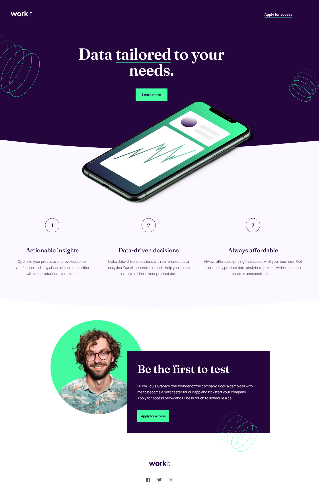

# Frontend Mentor - Workit landing page solution

This is a solution to the [Workit landing page challenge on Frontend Mentor](https://www.frontendmentor.io/challenges/workit-landing-page-2fYnyle5lu). Frontend Mentor challenges help you improve your coding skills by building realistic projects. 

## Screenshot

### Links

- Solution URL: [Add solution URL here](https://github.com/tugcekizildg/Workit_Landing_page_FrontendMentor)
- Live Site URL: [Add live site URL here](https://669aef0712f07f415eb35aa7--jovial-panda-b28e22.netlify.app)

### Built with

- Semantic HTML5 markup
- CSS custom properties
- Flexbox

## Author

- Website - [tugcekizildg](https://github.com/tugcekizildg)
- Frontend Mentor - [@tugcekizildg](https://www.frontendmentor.io/profile/tugcekizildg)

